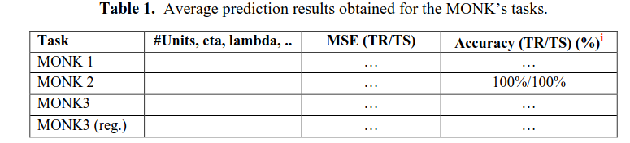
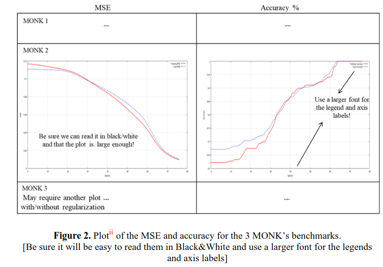
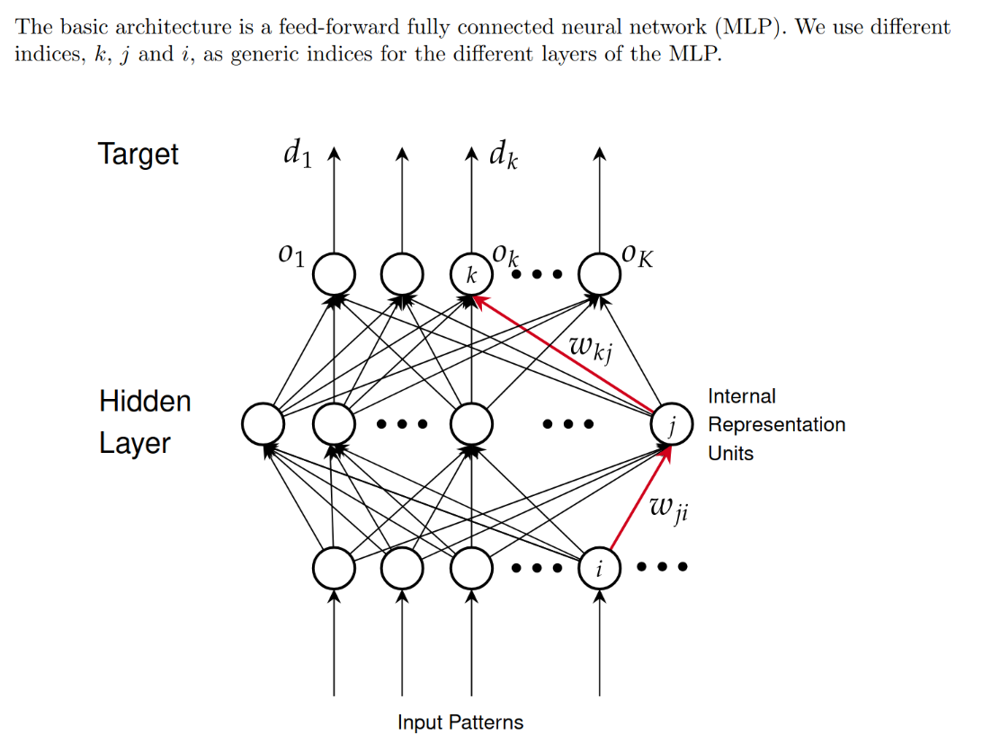

# TODO list
## Report
this is a list of all the thing needed in the project report

5. Try the monk Database (Monk1, Monk2, Monk3)
   6. Needed data for each problem are: hyperparameter used, MSE result and accuracy 
   7. Learning curve plot 
6. Try the CUP database
   1. Comparing results with different hyperparamether
   2. Comparing different learning curve
   3. Try different heuristic 
      1. early stopping
   4. Validation and tests
      1. Compere model selected with different validati on tecnique (old-out, k-fold CrossValidation) 
      2. Use an internal test set (portion of the CUP dataset) to asses performance
   5. Try different encoding (if applicable): plain-lable, 1-of-k
1. Comparing the different regularization aproches, L1 vs L2 vs maybe early stoping (try weight elimination)
2. Comparing convergenze time with different kinds of momentum
3. Comparing different learning strategyes: barch, mini-batch, Online
4. Comparing different architecture: 1 hidden layer, 2 hidden layer 3 hidden layer 
   1. Try layer with different unit number 

1. Monk results, Hyperparamether, Loss, Accuracy for all task
2. Validation, test scheme splitting for CUP 
3. 

## Implementation
Here a list of thinghs to implement in the code to fulfil the neads arised from the Report section, each entry refers to something int the report

9. Start from different starting point
1. implement a Multy Layer Perceptro (MLP) model
   2. Support arbitrary number of layer (for 4.,5. )
   1. backpropagation 
      2. Add support for Regularization L2 (for 1.)
      3. Add support for Regularization L1 (for 1.)
      1. Add support for standard Momentum (for 2.)
      2. Add support for nesterov Momentum (for 2.)
2. Implement some validation technique, Cross-validation or Old-Out
   
## Question
1. Ask if early stoppping is a valid regularization teqnique for regularization. (for 1.)
2. 

Ensemble Learning with boosting, if we have time

[link for the dataset structure](https://archive.ics.uci.edu/dataset/70/monk+s+problems)

[link for other dataset](https://archive.ics.uci.edu/)

## Monk know result
The MONK's Problems dataset defines six attributes with the following value ranges: $x_1=3$ $x_2=3$ $x_3=2$ $x_4=3$ $x_5=4$ $x_6=2$.
This results in $3×3×2×3×4×2=432$ possible combinations, which represent all potential instances (or examples) in the dataset.
Each instance includes: A class label(0,1), Six attribute values corresponding to the six descriptive variables and an ID.
For example, the instance (1, 1, 1, 1, 1, 3, 1) represents:

    A class label of 1.
    Attribute values: 1, 1, 1, 1, 3, 1 for a1 to a6.
    The ID data_5, which may also indicate the expected output.
We have 3 problem, each problem differ in the type of target concept to be learned and the noise

Problem 1, we have 124 training example, and we use al the 432 data for testing(216 pos 216 neg), Target concept:head_shape=body_shape∨jacket_color=redhead_shape=body_shape∨jacket_color=red..

Problem 2, we have 169 training example, and we use all the data(190 pos 142 neg),Target concept: Exactly two of the six attributes have a value of 1.

Problem 3, we have 122 training example, and we use all the data(204 pos 228 neg), the 5% of the exmple were miscalssaified, Target concept:
jacket_color=green and holding_a_sword∨(jacket_color≠blue∧body_shape≠octagon)jacket_color=green and holding_a_sword∨(jacket_color=blue∧body_shape=octagon).

In the book, page 9, we can see the result of the first problem with AQ17-DCI, and the state of the art result are 100% with a
rule based approach with data-driven constructive induction.

In the book, page 10, we can see the result of the first problem with AQ17-HCI, and the state of the art result are 100% with a
rule based approach with hypothesis-driven constructive induction.

In the book, page 11, we can see the result of the second problem with AQ17-DCI, and the state of the art result are 100% with a
rule based approach with data-driven constructive induction.

In the book, page 11, we can see the result of the second problem with AQ17-HCI, and the state of the art result are (93.06% and 86.57%) with a
rule based approach with hypothesis-driven constructive induction.

In the book, page 15, we can see the result of the third problem with AQ17-HCI, and the state of the art result are (100% 86.11%)) with a
rule based approach with hypothesis-driven constructive induction.

## Implementation of MLP
What is Multy Layer Perceptron? It is the simplest form of a feed-forward neural network. It is composed of multiple neurons.
Each neuron is a computation unit and it is defined as:
$$o_j=f_{\sigma}\left(\sum^n_{i=0} w_{i,j}o_i\right)$$

Having multiple neurons means that we want to be able to calculate $o_i$ which is the output of the neurons in the previous layer.
previes4
We have to start from the input. For each input $x_i$ we will have a first layer where $$o_i=x_i \ \ \forall i=0,...,n_{in}$$ where $n_{in}$ is the dimensionality of the input $\mathbf{x}$.

The second layer will be $$o_j=f_{\sigma}\left(\sum^n_{i=0} w_{i,j}o_i\right) \forall j=0...m_1$$ where $m_1$ is the number of neuron of that layer.

The output layer will be $$o_j=f_{out}\left(\sum^n_{i=0} w_{i,j}o_i\right) \forall j=0...n_o$$ where $n_o$ is the dimensionality of the output.

In this way we can have a 3 layer Feed-Forward, but it can be expanded to add an arbitrary number of layers.

# Implement Backpropagation.

The backpropagation is a generalization of the $\delta$ rule with multi layer perceptron.

Its primary goal is to compute the gradient of the error function with respect to the network's weights efficiently, enabling optimization through gradient descent.

Nice properties, is eazy because the compositional form of the model, it keep track only of quantities local to each unit(like errors(?)) and is efficient!

It propagates the error from the output layer back to the input layer.

It relies on the chain rule to calculate gradients across the layers of the network.

We want to minimize te total error, where total error is
$$E_{tot}=\sum_{p=0}{(1/2)\sum_{k=1}^K{(d_k-o_k)}^2}$$

p is the index of a training example, k is the index of the output unit.

Then compute the gradient and update all the weights W in the network, 
$$\delta E_{tot}/ \delta w$$

For each output unit, calculate the error:
$e_k=d_k−o_k$ and then we do the Error Propagation using the cain rule, to calculate the error for each hidden neuron based on the output error,and we update the specific weight with a specific learning rate

we have some problem with this formula, like the Vanishing Gradient Problem. 
# Encoding

# Learing strategy
We have to implement each of the possible learning strategy
-  Batch: each the pattern $p$ are presented to the network and the new gradient is evaluated to update the weight
-  Stocastic/on-line: a single pattern $p$ is passed through the network and the weight is update before going to te next patter 
-  Mini-Batch: a set of $k$ patter are passed to the network and the gradient in evaluated on the $k$ patter and the weight are calculated

__batch__ is considered to be the most stable, but it is also the slowest because each patern need to be loaded in memory e usualy they dont fit in the GPU memory

__Stocastic/On-line__ is the fasts in terms of performance, but it is noisy and unstable

__Mini-Batch__: Is usually the go to choose since offer a good stability and a good efficiency 

# Add momentum
The momentum is a technique to have a more stable gradient descent iteration.

it is done by changing the update rule where instead of just changing the with using the gradient 
you also add the old gradient
so instead of having $$\mathbf{w}_{new}=\mathbf{w} -\eta \nabla W$$
we have 
$$W_{new}= \mathbf{w} -\eta\nabla \mathbf{w} + \alpha\nabla W_{old}$$

the ensure stability by dumping the oscillation on the gradient

#### Nesterov momentum variant
the Nesterov Variant is the following:
first add the momentum to the current with and save this a temporary with $W_{temp}$ and then calculate the gradiant at this temporary point
the update rule become as follows:
$$\begin{array}{}
\mathbf{w}_{temp} &=& \alpha \mathbf{w} +   \eta\nabla W_{old}\\
\mathbf{w}_{new} &=& \mathbf{w} + \nabla W_{temp}
\end{array}$$
This update rule is know to have a faster convergence, used in batch mode and [maybe for SGD (mini-batch)](https://medium.com/@giorgio.martinez1926/nesterov-momentum-explained-with-examples-in-tensorflow-and-pytorch-4673dbf21998)

[Da capire meglio questa fonte](https://stats.stackexchange.com/questions/179915/whats-the-difference-between-momentum-based-gradient-descent-and-nesterovs-acc)

# Add Regularization L2 (L2 = norm 2)
The regularization is a method that's used to control the complexity of the model in order to reduce overfitting and improve generalization.
Applied the L2 regularization is an IMPLICIT method to controll the complexity.

This penalizes large weights values and encourage the model to prefer smaller values to reduce the complexity of the model itself.
We need this because during the training process the hypothesis space continue to change and hidden units tend to saturate.

L2 is the common Tikhonov regularization that add a penalty term to the loss. 
The new loss function is:
$$Loss=\sum_{p=0}^l{(d_p-h(\mathbf{x}_p))^2}+\lambda||\mathbf{w}||^2$$

The $||\mathbf{w}||^2$ is like the sum over all $w$ $\left(\sum_i w_i^2\right)$.

$\lambda$ is a hyperparameter, so it's searching with the hyperparameters search.
If it's applied to a linear model is like the ridge regression.
The general objective is the minimization of the loss function so, with this term, is possible trying to reduce the $||\mathbf{w}||$. 
If $\lambda \to 0$ implies the non-regularization of the model and if $\lambda \to \infty$ we heve a strictly costraint model.

## Weight decay
In a neural netork, the penalty term $\lambda$ will contribute, as optimizer, in the weights update adding a factor that reduce the weights at each update step.
We can simply add to the $\mathbf{w}_{new}$ the old $\mathbf{w}$ weighted with $\lambda$:
$$\mathbf{w}_{new}=\mathbf{w}+\eta\Delta\mathbf{w}+2\lambda\mathbf{w}$$

## Alternatives 
For the control of the model complexity there are others methods that are explicit and implicit.
- Implicit : L1, 
- Explicit : Early stopping

### Early stopping
Besides the L2 is possible to use the early stopping.
This method consists of stopping the training when are satisfy some criterias in the validation set, for example, if the error has few changes.
If the model is well regularized with L2 could be not necessary doing the early stopping

### L1

# Hyperparameters search
We need to do a grid search on 
- $\eta$ : the learning rate
- $\lambda$: the regularization parameter
- $\alpha$: The momentum parameter

# Bib
1. https://gwern.net/doc/ai/tabular/1991-thrun.pdf 