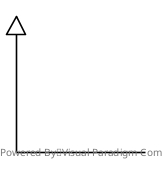

# TODO list
## Report
this is a list of all the thing needed in the project report
1. Write a README for the code base.
   1. describing what we have done and what he have used to done it 
5. Try the monk Database (Monk1, Monk2, Monk3)
   6. Needed data for each problem are: hyperparameter used, MSE result and accuracy 
   7. Learning curve plot 
6. Try the CUP database
   4. Validation and tests
      1. include the validation splitting used to generate the data. 
      2. Compere model selected with different validation technique (old-out, k-fold CrossValidation) 
      3. Use an internal test set (portion of the CUP dataset) to asses performance
   1. Grid search for hyperparamethers of the model
      2. Comparing results with different hyperparamether
      3. explayn some result and thread obtained with the iper paramether search
   4. Description of the final model selection process
      1. Comparing the different regularization approaches, L1 vs L2 vs maybe early stopping (try weight elimination)
      2. Comparing convergence time with different kinds of momentum
      3. Comparing different learning strategies: barch, mini-batch, Online
      4. Comparing different architecture: 1 hidden layer, 2 hidden layer 3 hidden layer 
         1. Try layer with different unit number 
      3. Try different heuristic  
         1. early stopping
      5. Try different encoding (if applicable): plain-label, 1-of-k
   3. Report on the final model Selected
      1. Report with the hyperparamether selected for the final model
      2. Report the result of the final model in a table with all the used matric (MSE, MEE , RMEE)
      3. Plot the learning curve (Treaning, validation, and internal test set)
   4. Disccussion on result

## Implementation
Here a list of things to implement in the code to fulfil the neads arised from the Report section, each entry refers to something int the report

1. implement a Multy Layer Perceptron (MLP) model
   2. Support arbitrary number of layer (for 4.,5. )
      3. Implement a modular structure  (layer)
   1. backpropagation 
      9. Start from different starting point
      2. Add support for Regularization L2 (for 1.)
      3. Add support for Regularization L1 (for 1.)
      1. Add support for standard Momentum (for 2.)
      2. Add support for Nesterov Momentum (for 2.)
2. Implement some validation technique like Cross-validation or Old-Out
3. Implement Early Stopping
7. implement Results for epoch Save.
   4. Implement Utility to plot results.
5. Implement Utility to Log HyperParameter results.
6. Implement weight auto Save
   
## Question
1. Ask if early stopping is a valid regularization technique for regularization. (for 1.)

Ensemble Learning with boosting if we have time

[link for the dataset structure](https://archive.ics.uci.edu/dataset/70/monk+s+problems)

[link for other dataset](https://archive.ics.uci.edu/)

## Monk Dataset
The MONK's dataset defines 3 __binary classification__ task
each task defines six attributes with the following value ranges: 
- $x_1\in [1-3]$
- $x_2\in [1-3]$
- $x_3\in [1-2]$
- $x_4\in [1-3]$
- $x_5\in [1-4]$
- $x_6\in [1-3]$ 

This results in $3×3×2×3×4×2=432$ possible combinations of input, which represent all potential instances (or examples) in the dataset.

We have 3 problem , each problem differ in the type of target concept to be learned and the noise

Problem 1, we have 124 training example, and we use al the 432 data for testing(216 pos 216 neg), Target concept:$head_shape=body\_shape\lor jacket\_color=redhead\_shape=body\_shape\lor jacket\_color=red..$

Problem 2, we have 169 training example, and we use all the data(190 pos 142 neg),Target concept: Exactly two of the six attributes have a value of 1.

Problem 3, we have 122 training example, and we use all the data(204 pos 228 neg), the 5% of the exemple were misclassified, Target concept:
$jacket_color=green$ and $holding\_a\_sword \lor (jacket\_color \not =blue\land body_shape\not=octagon)jacket\_color=green$ and $holding\_a\_sword\lor(jacket\_color=blue\land body\_shape=octagon)$.

In the book, page 9, we can see the result of the first problem with AQ17-DCI, and the state of the art result are 100% with a
rule based approach with data-driven constructive induction.

In the book, page 10, we can see the result of the first problem with AQ17-HCI, and the state of the art result are 100% with a
rule based approach with hypothesis-driven constructive induction.

In the book, page 11, we can see the result of the second problem with AQ17-DCI, and the state of the art result are 100% with a
rule based approach with data-driven constructive induction.

In the book, page 11, we can see the result of the second problem with AQ17-HCI, and the state of the art result are (93.06% and 86.57%) with a
rule based approach with hypothesis-driven constructive induction.

In the book, page 15, we can see the result of the third problem with AQ17-HCI, and the state of the art result are (100% 86.11%)) with a
rule based approach with hypothesis-driven constructive induction.

## CUP dataset
the CUP dataset is a multiple regression task .
The Training set is composed of 500 example each of which have 12 variable and 3 target, and a pattern id (why?)
The test set is blind meaning that we do not have the correct label, this is the set used for win the competition.
this dataseet need 3 metrics: 
1. __Mean Euclidian Error__: $$M_{MEE}\cfrac{1}{l}\sum^l_{p=1} \| \mathbf{o}_p - \mathbf{t}_p  \|$$
2. __Mean squared Error__ : $$E_{MSE}= \cfrac{1}{l}\sum^l_{p=1}(\mathbf{o}_p -\mathbf{t}_p)^2$$
3. __Root Mean squared Error__: $$E_{RMSE}= \sqrt{\cfrac{1}{l}\sum^l_{p=1}(\mathbf{o}_p -\mathbf{t}_p)^2}$$

## Implementation of MLP
What is Multy Layer Perceptron? It is the simplest form of a feed-forward neural network. It is composed of multiple neurons.
Each neuron is a computation unit and it is defined as:
$$o_j=f_{\sigma}\left(\sum^n_{i=0} w_{i,j}o_i\right)$$

Having multiple neurons means that we want to be able to calculate $o_i$ which is the output of the neurons in the previous layer.
previes4
We have to start from the input. For each input $x_i$ we will have a first layer where $$o_i=x_i \ \ \forall i=0,...,n_{in}$$ where $n_{in}$ is the dimensionality of the input $\mathbf{x}$.

The second layer will be $$o_j=f_{\sigma}\left(\sum^n_{i=0} w_{i,j}o_i\right) \forall j=0...m_1$$ where $m_1$ is the number of neuron of that layer.

The output layer will be $$o_j=f_{out}\left(\sum^n_{i=0} w_{i,j}o_i\right) \forall j=0...n_o$$ where $n_o$ is the dimensionality of the output.

In this way we can have a 3 layer Feed-Forward, but it can be expanded to add an arbitrary number of layers.

# Implement Backpropagation.  
  
The backpropagation is a generalization of the $\delta$ rule with multi layer perceptron.  
It's a fundamental algorithm for the training of the model that compute the gradient of the error function with respect to the network's weights.  
  
  
It propagates the error from the output layer back to the input layer.  
It relies on the chain rule to calculate gradients across the layers of the network.  
  

---
TODO:
-> Backpropagation algorithm depended by the learning method :  
- Batch :
- Stochastic :
- Online :
---

We want to minimize the total error, that is:  
$$E_{tot}=\sum_{p=0}^l{(1/2)\sum_{k=1}^K{(d_k-o_k)}^2}$$  
  
where $p$ is the index of a training example, $K$ is the index of the output unit.  
  
We know that the direction where the function is maximum is given by the gradient, and for our objective, we want to follow the opposite.   
So compute the gradient for each $\mathbf w$ as:   
$$\nabla E_{tot} = \frac{\partial E_{tot}}{\partial w}$$  
And take the opposite direction $\Delta w=-\nabla E_{tot} = -\frac{\partial E_{tot}}{\partial w}$  . 
At each step we want to update the weights using this new direction to minimize the error.
The new $\mathbf{w}$ will be:$$\mathbf{w}_{new}=\Delta \mathbf{w}+\eta \mathbf{w}$$
where $\eta$ is the learning rate.

---
TODO:
- espansione della derivata, 
- calcolo del delta
- update per ultimo layer, layer di mezzo e primo layer
___
???
For each output unit, calculate the error:  
$e_k=d_k−o_k$ and then we do the Error Propagation using the cain rule, to calculate the error for each hidden neuron based on the output error,and we update the specific weight with a specific learning rate  
  
we have some problem with this formula, like the Vanishing Gradient Problem.   
___

# Encoding

# Learnig strategy
We have to implement each of the possible learning strategy
-  Batch: each the pattern $p$ are presented to the network and the new gradient is evaluated to update the weight
-  Stochastic/on-line: a single pattern $p$ is passed through the network and the weight is update before going to te next patter 
-  Mini-Batch: a set of $k$ patter are passed to the network and the gradient in evaluated on the $k$ patter and the weight are calculated

__batch__ is considered to be the most stable, but it is also the slowest because each patern need to be loaded in memory e usualy they dont fit in the GPU memory

__Stochastic/On-line__ is the fasts in terms of performance, but it is noisy and unstable

__Mini-Batch__: Is usually the go to choose since offer a good stability and a good efficiency 

# Add momentum
The momentum is a technique to have a more stable gradient descent iteration.

it is done by changing the update rule where instead of just changing the with using the gradient 
you also add the old gradient
so instead of having $$\mathbf{w}_{new}=\mathbf{w} -\eta \nabla W$$
we have 
$$W_{new}= \mathbf{w} -\eta\nabla \mathbf{w} + \alpha\nabla W_{old}$$

the ensure stability by dumping the oscillation on the gradient

#### Nesterov momentum variant
the Nesterov Variant is the following:
first add the momentum to the current with and save this a temporary with $W_{temp}$ and then calculate the gradiant at this temporary point
the update rule become as follows:
$$\begin{array}{}
\mathbf{w}_{temp} &=& \alpha \mathbf{w} +   \eta\nabla W_{old}\\
\mathbf{w}_{new} &=& \mathbf{w} + \nabla W_{temp}
\end{array}$$
This update rule is know to have a faster convergence, used in batch mode and [maybe for SGD (mini-batch)](https://medium.com/@giorgio.martinez1926/nesterov-momentum-explained-with-examples-in-tensorflow-and-pytorch-4673dbf21998)

[Da capire meglio questa fonte](https://stats.stackexchange.com/questions/179915/whats-the-difference-between-momentum-based-gradient-descent-and-nesterovs-acc)

# Add Regularization L2 (L2 = norm 2)
The regularization is a method that's used to control the complexity of the model in order to reduce overfitting and improve generalization.
Applied the L2 regularization is an IMPLICIT method to control the complexity.

This penalizes large weights values and encourage the model to prefer smaller values to reduce the complexity of the model itself.
We need this because during the training process the hypothesis space continue to change and hidden units tend to saturate.

L2 is the common Tikhonov regularization that add a penalty term to the loss. 
The new loss function is:
$$Loss=\sum_{p=0}^l{(d_p-h(\mathbf{x}_p))^2}+\lambda||\mathbf{w}||^2$$

The $||\mathbf{w}||^2$ is like the sum over all $w$ $\left(\sum_i w_i^2\right)$.

$\lambda$ is a hyperparameter, so it's searching with the hyperparameters search.
If it's applied to a linear model is like the ridge regression.
The general objective is the minimization of the loss function so, with this term, is possible trying to reduce the $||\mathbf{w}||$. 
If $\lambda \to 0$ implies the non-regularization of the model and if $\lambda \to \infty$ we have a strictly costraint model.

## Weight decay
In a neural network, the penalty term $\lambda$ will contribute, as optimizer, in the weights update adding a factor that reduce the weights at each update step.
We can simply add to the $\mathbf{w}_{new}$ the old $\mathbf{w}$ weighted with $\lambda$:
$$\mathbf{w}_{new}=\mathbf{w}+\eta\Delta\mathbf{w}+2\lambda\mathbf{w}$$

## Alternatives 
For the control of the model complexity, there are other methods that are explicit and implicit.
- Implicit : L1, (like )
- Explicit : Early stopping
- Dropout
- Batch normalization (??)

### Early stopping
Besides the L2 is possible to use the early stopping.
This method consists of stopping the training when are satisfy some criterias in the validation set, for example, if the error has few changes.
If the model is well regularized with L2 could be not necessary doing the early stopping

## Bias-Variance implication
- A model that is over regularized will have a high bias and a low variance. 
  In this way the model is too rigid, and it's possible to be underfitting
- A model with a low penalty term will have a low bias and a high variance.
  This implies a great dependence on dataset and overfitting.

# Regularization and momentum in the weight update 

# Hyperparameters search
We need to do a grid search on 
- $\eta$ : the learning rate
- $\lambda$: the regularization parameter
- $\alpha$: The momentum parameter

## Code Structure
This is a description of the code of this repo

The __FeedForwardModel__ class encapsulates the logic for a FeedForward model. 
- __Layers__: an array of layers, assumed that the __Layers[i]__ is directly connected to __Layers[i+1]__, Where __Layers[i+1]__ is the furthers from the input
- __input Layer__: the first Layer
- __output Layer__: the last layer
- __Optimizer__: it is the learning algorithm used to train the model
- __Metric__: a list of metrics to keep track
- __MetricResult__ : a matrix to keep track of the result of each metric for each epoch 
- __*Fit(epoch,batchSize)*__: start the Training loop, specify the number of epoch and the dimension of the batch (unset for Batch, set for mini-Batch, 1 for online)
- __*AddLayer(newlayer)*__: Sequentially add a layer to the model (__layers[layer.size()]=newLayer__)
- __*SaveModel(path)*__ : Save the model on file, layer weight, and some medtadata.
- __*LoadModel(path)*__ : Save the model from a file.
- __*SetOptimizer(optimizer)*__: Set the optimizer algorithm
- __*AddMetrics(metric)*__: add metric to __Metrics__.
- __*AddMetrics(metric[])*__ add metrics to __Metrics__

The __Layer__ class encapsulates the logic of a single layer
- __WeightToNextLayer__ is represented with a Matrix $M \in R^{Unity\times NextLayer_{unit}}$
- __Unit__: the number of units of that layer
- __ActivationFunction__: activation Function used by the unit of this layer 
- __NextLayer__: the layer after this layer
- __LastLayer__: the layer before this layer
- __*Update(weightMod)*__: update the weight of this layer with the argument ($w+=\eta wm$)
- __*Compute()*__: compute the forward pass.

The __LearningPropagation__ is a class to encapsulate the BackPropagation algorithm its parameter
- __lambda__: the Regularization parameter
- __Momentum__: the Momentum parameter
- __eta__: the learning rate
- __LossFunction__ : the loss function to optimize
- __*ComputeUpdate()*__: compute the weight modification wanted

The __ErrorFunction__ is a class to encapsulate a metrics or a loss
- __Error(val[],target[])__: compute a function selected to be the error 

The __MiniBatchGenerator__ is a class to encapsulate the generation of minibatch
- __Data__: the dataset to be divided in mini batch
- __BatchSize__: the size of each batch
- __LastPosition__: the last data in the batch
- __*NextBatch()*__: generate the next batch. if there are not enough data return only the remaining data
- __*Reset()*__: reset the miniBatch generation

The __Activation Function__: is a class to encapsulate an activation function and it derivative
- __*Calculate()*__: Calculate the value of the function
- __*CalculateDerivative()*__: Calculate the derivative of the function

# Bibliography
1. https://gwern.net/doc/ai/tabular/1991-thrun.pdf 